# 15款网页抓取浏览器工具盘点:哪个最适合你的数据采集需求?

---

想从网站上提取数据,但不想折腾复杂的代码?这几年基于浏览器的网页抓取工具火了起来——点点鼠标就能搞定数据采集,从电商价格监控到竞品分析,应用场景相当广泛。市面上工具这么多,我们整理了15款主流产品,帮你找到真正适合自己项目的那一个。

---

## 1. Bright Data

Bright Data的抓取浏览器(Scraping Browser)把代理管理和页面解锁功能整合到了一起。你用Puppeteer或Playwright的API操作,它在后台自动帮你搞定IP轮换、验证码破解这些麻烦事。

最厉害的是它的代理网络——全球7200万+住宅IP和200万+移动IP,覆盖范围没谁了。对付那些动态加载内容的网站特别有用,JavaScript渲染、Ajax请求这些都能处理。支持Python、Node.js、Java等主流语言,还能和AWS、Google Cloud无缝对接。

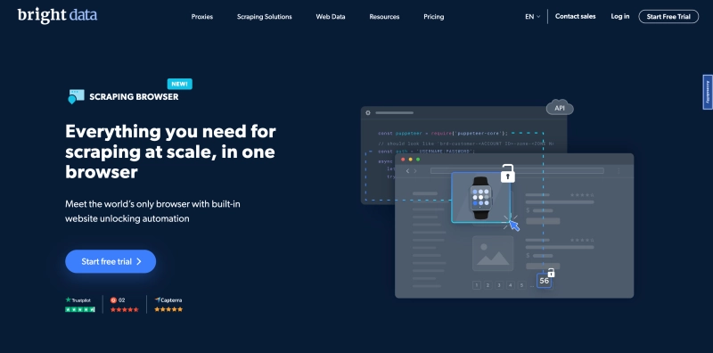

要说缺点,就是学习成本比纯可视化工具高一点。但功能强大啊,适合需要大规模、高稳定性数据采集的场景。

**定价:** 13.50美元/GB起

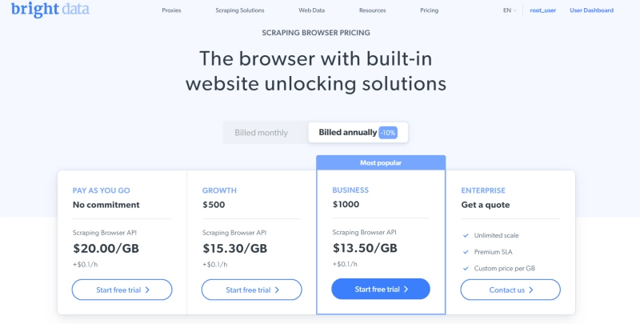

## 2. Octoparse

Octoparse就是为"不会编程但需要采集数据"的人设计的。可视化界面做得很直观,鼠标点哪儿抓哪儿,零代码基础也能上手。

除了基础的数据提取,它还有数据清洗和转换功能。抓下来的数据往往格式乱、有重复,Octoparse能帮你自动处理这些问题。比如去掉多余空格、删除重复条目、统一日期格式等等,省了不少后期整理的功夫。

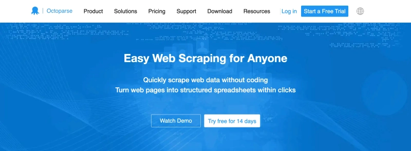

对于中小型项目来说,Octoparse的性价比挺高。但处理超大规模数据时,速度和并发能力会有点吃力。

**定价:** 免费版可用,付费版89美元/月起

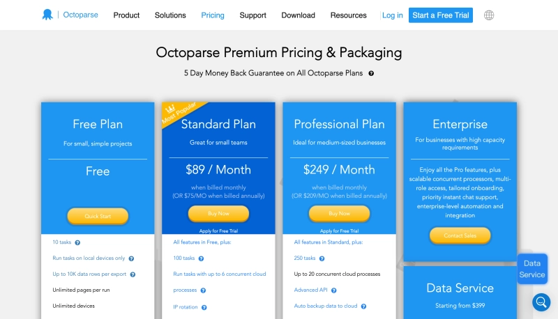

## 3. ParseHub

ParseHub在处理动态网页方面有两把刷子。很多网站的内容是靠JavaScript动态加载的,普通爬虫可能抓不到完整数据,ParseHub用了浏览器模拟技术,能等页面完全加载完再提取内容。

它的点选界面设计得也不错,操作逻辑比较清晰。更厉害的是支持定时抓取和API集成——你可以设置每天自动抓取最新数据,或者把抓取功能直接嵌入到自己的系统里。

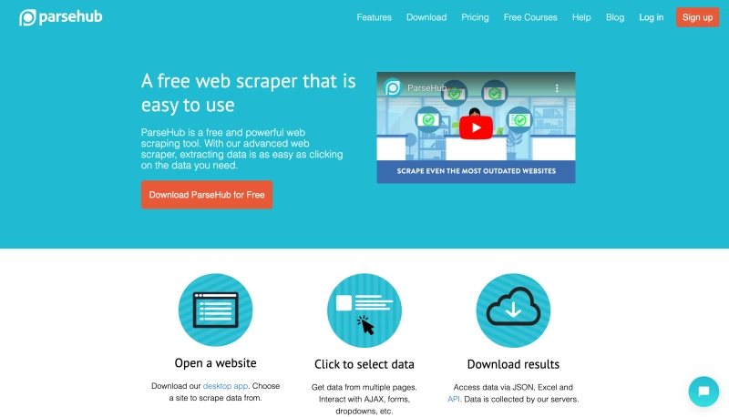

适合需要持续监控数据变化的场景,比如追踪竞品价格、监测新闻动态这种。

**定价:** 免费版可用,付费版189美元/月起

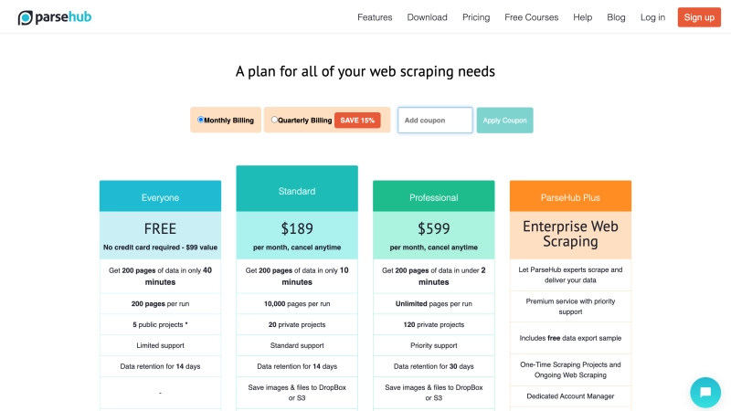

## 4. Webz.io

Webz.io专注在新闻、博客、论坛这类内容的抓取和监控上。如果你需要追踪某个话题的网络舆情,或者分析行业资讯趋势,这个工具挺合适。

它的数据覆盖面很广,从主流媒体到小众博客都有。提供API接口,可以直接把数据流接入你的分析系统。对于做市场研究、品牌监测的团队来说,能节省大量人工搜集信息的时间。

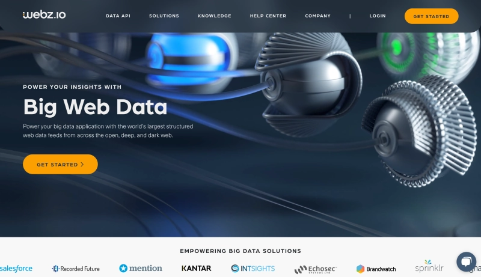

不过它主要面向B2B市场,价格不太透明,需要联系销售团队定制方案。

**定价:** 需联系供应商

## 5. Import.io

Import.io的智能识别功能做得不错。你只需要点几个示例数据,它就能自动识别页面结构和数据模式,然后批量抓取同类页面。这个对处理结构相似的列表页特别有用。

👉 [想了解更强大的数据抓取解决方案?](https://www.scraperapi.com/?fp_ref=coupons)

支持多种数据导出格式——CSV、Excel、JSON随便选,对接其他系统也方便。云端处理的方式让你不用操心服务器的事儿,开个浏览器就能管理抓取任务。

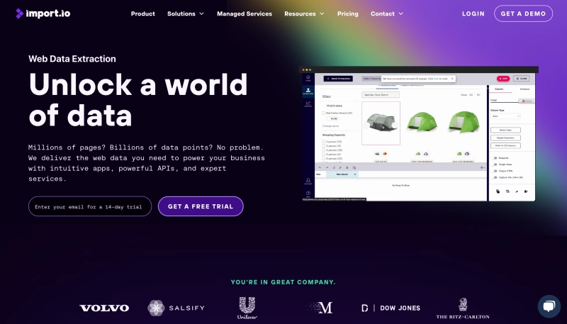

适合中等规模的数据采集项目,特别是需要频繁调整采集规则的场景。

**定价:** 14天免费试用,付费版199美元/月起

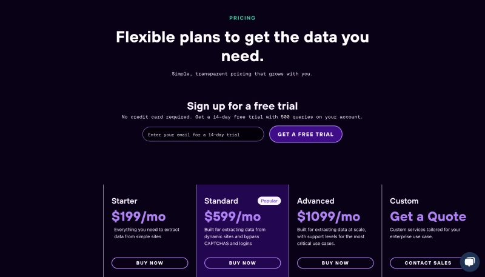

## 6. Dexi.io

Dexi.io的可视化编辑器做得挺细致,支持构建复杂的抓取流程。你可以设置条件判断、循环提取、数据关联这些高级操作,但不需要写代码。

它还有个数据丰富(Data Enrichment)功能——能自动从其他数据源补充信息。比如抓了一批公司名称,可以自动匹配填充行业分类、联系方式这些额外字段。这个功能在做数据整合时挺实用。

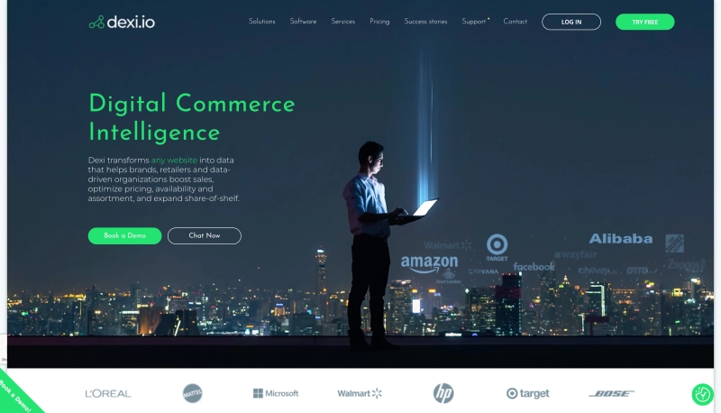

提供API访问,方便集成到现有工作流。整体来说功能比较全面,适合对数据质量要求高的项目。

**定价:** 提供免费试用,具体价格需联系销售

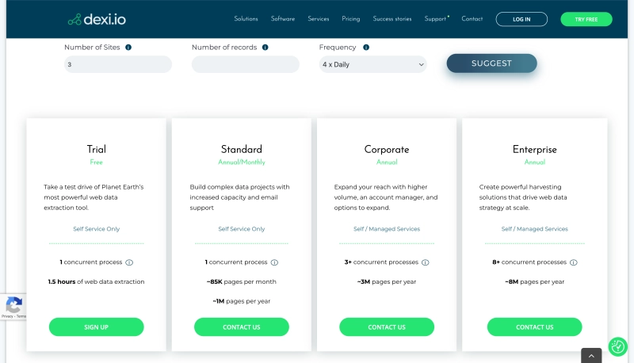

## 7. Mozenda

Mozenda在企业级应用方面经验比较丰富。除了基本的点选抓取,还支持设置复杂的定时任务和数据处理流程。

它的调度系统做得很灵活——可以按小时、天、周设置不同的抓取频率,还能根据数据变化触发抓取。数据导出选项也比较丰富,Excel、CSV、XML、数据库直连都支持。

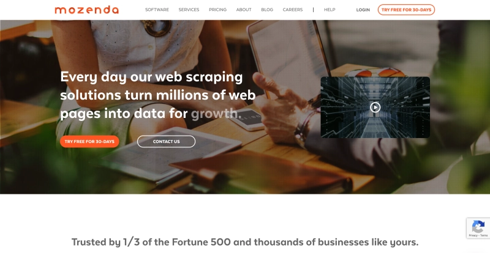

适合有长期、大规模数据采集需求的企业。不过价格不菲,小团队可能会觉得有点贵。

**定价:** 提供免费试用,具体价格需咨询

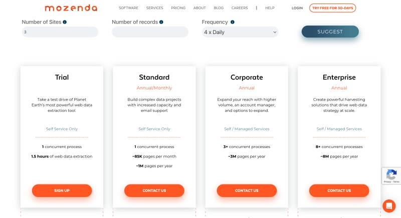

## 8. ScrapingBee

ScrapingBee走的是API服务路线。你只管发请求,它帮你搞定浏览器渲染、JavaScript执行、代理轮换、验证码识别这一整套。

对开发者来说特别友好——几行代码就能集成到现有项目里。支持多种编程语言,文档写得也清楚。处理单页应用(SPA)和动态加载内容的能力很强,适合抓取现代前端框架搭建的网站。

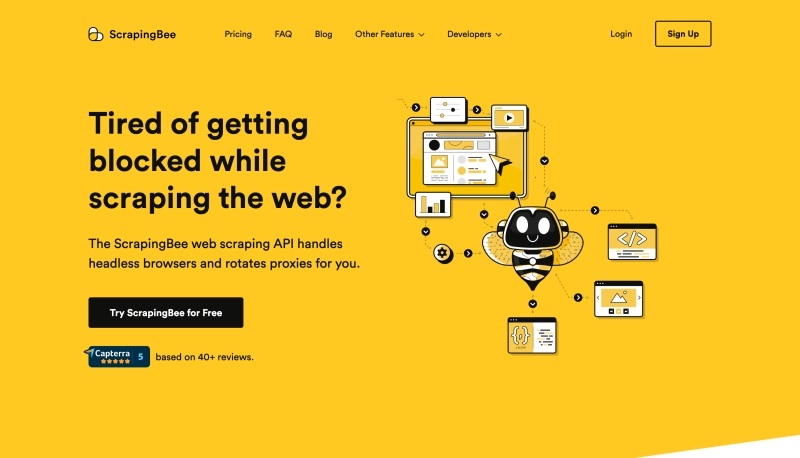

价格按请求次数计费,用多少付多少,对小规模项目比较友好。

**定价:** 49美元/月起

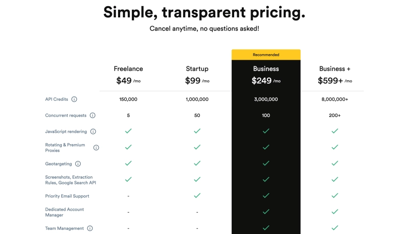

## 9. Apify

Apify是个云端自动化平台,不只是网页抓取,各种浏览器自动化任务都能做。它的市场(Marketplace)有上百个现成的"actor"(预配置的抓取脚本),覆盖Amazon、Google Maps、Instagram等主流网站。

如果市场里没有你要的,可以用可视化编辑器自己搭建,也可以直接写代码。支持Puppeteer和Playwright,灵活度很高。云端运行的方式让你不用担心服务器配置和维护。

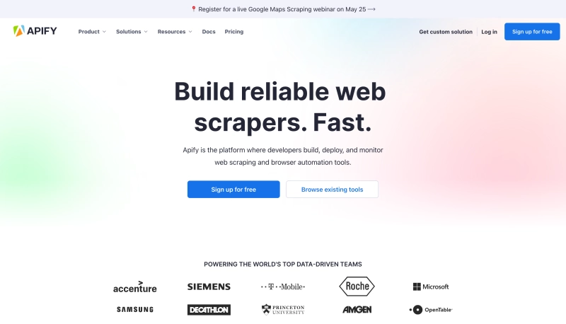

适合既需要标准化抓取,又有定制需求的团队。

**定价:** 免费版可用,付费版49美元/月起

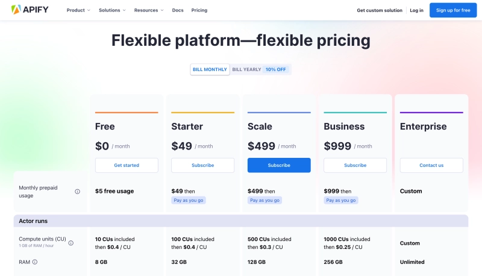

## 10. ScrapingDog

ScrapingDog主打简单易用。API接口设计得很简洁,几个参数就能发起请求。自动处理JavaScript渲染、验证码识别、IP轮换这些常见问题。

响应速度比较快,并发性能也不错。对于需要快速搭建数据采集功能的开发者来说,能省不少时间。定价相对亲民,适合预算有限的小团队。

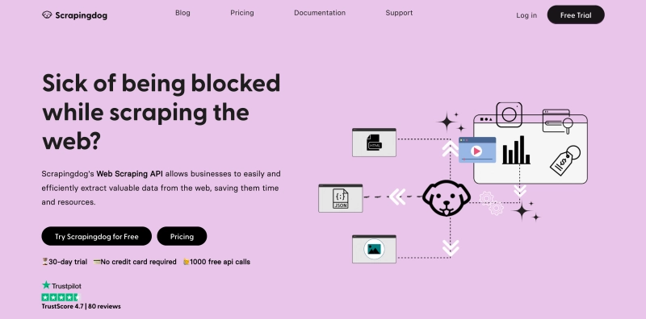

功能没有那些大厂工具全面,但胜在够用、稳定、便宜。

**定价:** 30美元/月起

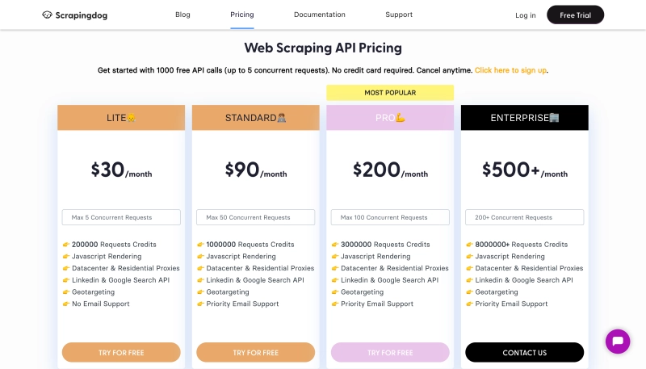

## 11. Byteline

Byteline在处理动态网页方面表现不错,JavaScript渲染能力比较强。代理和IP轮换功能内置,不需要额外配置。

支持多种数据导出格式,方便对接后续的分析工具。界面设计比较现代,操作逻辑清晰。整体来说是个中规中矩的选择,功能够用,价格也算合理。

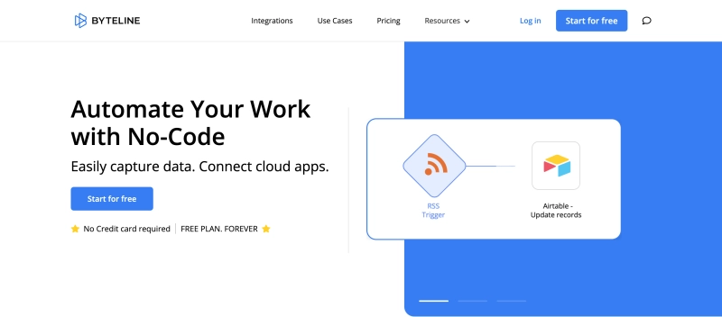

适合中小规模的数据采集项目。

**定价:** 免费版可用,付费版14美元/月起

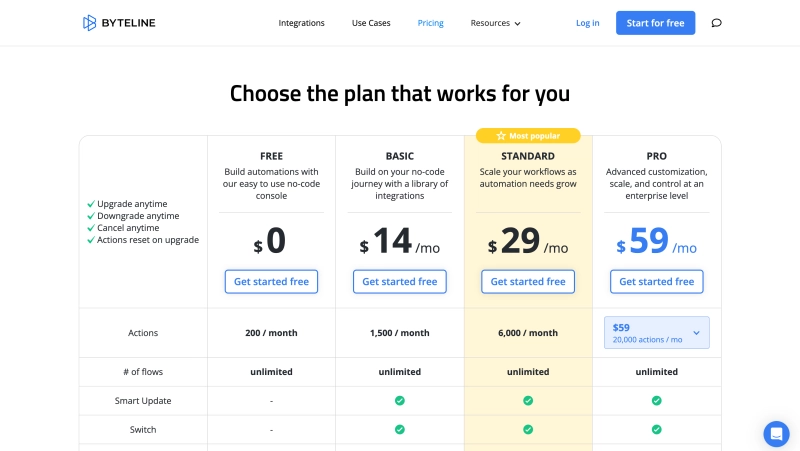

## 12. Grepsr

Grepsr采用云端处理架构,你不需要操心服务器的事儿。支持复杂网站的抓取,包括那些大量使用JavaScript的现代网站。

调度功能做得挺灵活,可以设置定时自动抓取。数据导出格式丰富——CSV、Excel、JSON、XML都支持。还提供数据验证功能,能自动检查抓取结果的完整性和准确性。

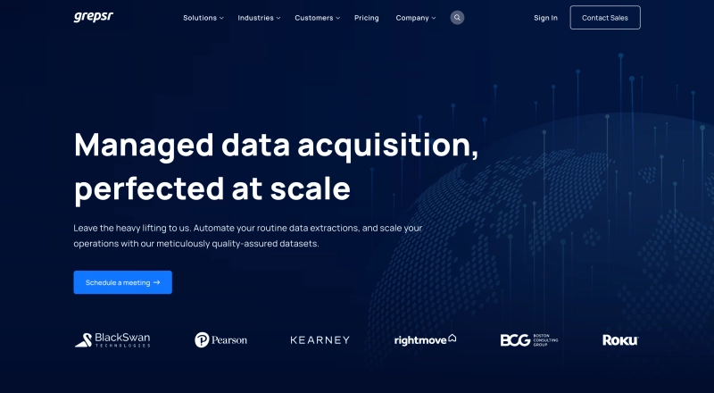

适合对数据质量要求比较高的项目。

**定价:** 需联系供应商

## 13. ProWebScraper

ProWebScraper的点选界面用起来挺顺手,不需要编程经验就能上手。有个亮点是支持需要登录的网站——输入账号密码后,可以抓取登录后才能看到的内容。

提供定制化的抓取服务,如果遇到特别复杂的网站,可以让他们团队帮忙搞定。支持网络爬虫,可以跨多个页面提取数据。还内置了数据验证功能,确保抓取结果的准确性。

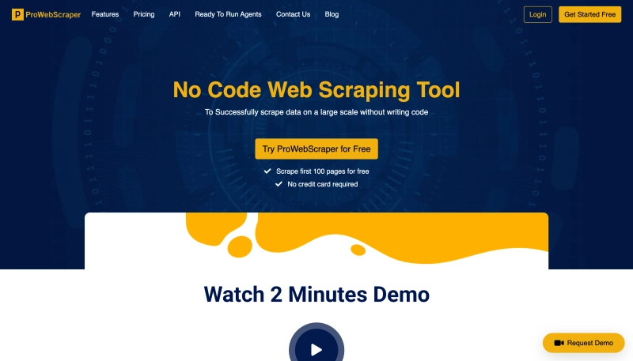

对于非技术背景的用户来说比较友好。

**定价:** 免费版可用,付费版5000美元/40个积分起

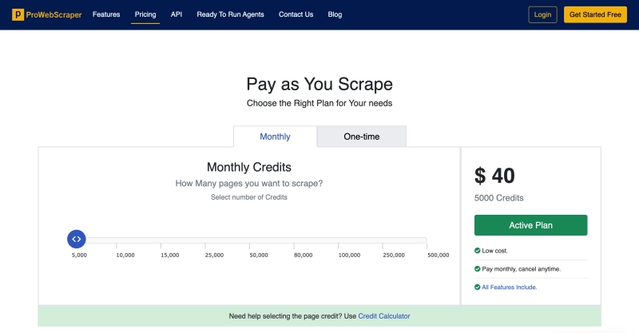

## 14. ScraperAPI

ScraperAPI用无头浏览器技术处理网页渲染和JavaScript执行。支持多种编程语言——Python、JavaScript、PHP都能用。

内置代理轮换功能,自动帮你切换IP,避免被网站封禁。错误处理和重试机制做得比较完善,抓取成功率高。支持多种数据格式输出——HTML、JSON、XML,方便集成到不同系统。

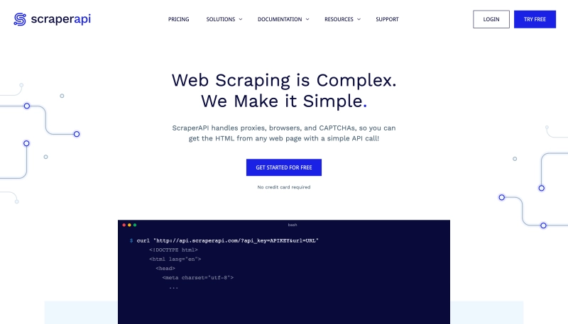

API文档写得清楚,开发者友好。适合需要稳定、可靠数据采集的项目。

**定价:** 49美元/月起

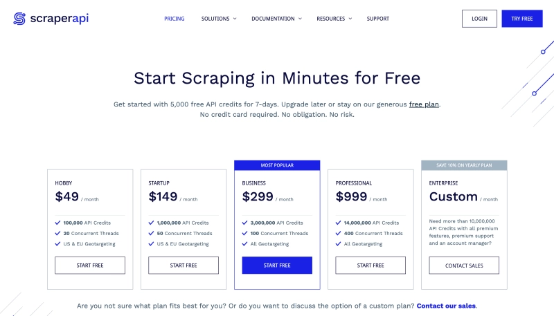

## 15. Zyte

Zyte(原Scrapy Cloud)在网页抓取领域算是老牌了。用无头浏览器处理动态内容,JavaScript渲染、Ajax请求都能搞定。

支持多种编程语言——Python、JavaScript、Ruby,开发者可以用自己熟悉的技术栈。云端基础设施做得比较成熟,可扩展性强,适合大规模数据采集项目。

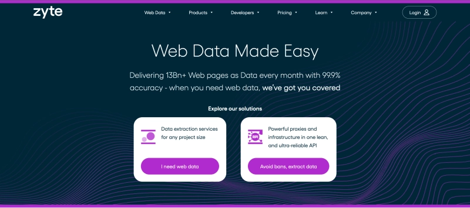

内置代理管理功能,自动处理IP轮换。支持多种数据存储方式,可以直接对接数据库或通过API输出。

**定价:** 450美元/月起

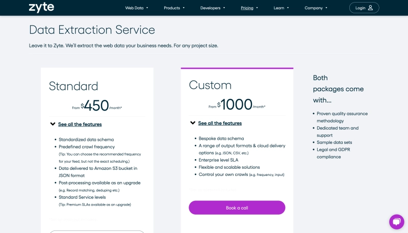

---

## 怎么选最合适?

选网页抓取工具,关键看这几点:

**技术门槛** - 会不会编程?Octoparse、ParseHub这种可视化工具适合小白;ScrapingBee、ScraperAPI更适合开发者。

**项目规模** - 偶尔抓点数据,免费版或低价方案够用;持续大规模采集,得选Bright Data、Zyte这种能扛住压力的。

**目标网站复杂度** - 简单静态页面好说,动态加载、需要登录、有反爬机制的网站,得选功能更强的工具。

**预算** - 价格差距挺大的,从免费到几百美元一个月都有。看你能接受哪个价位。

如果你需要的是稳定、覆盖广、功能全面的解决方案,Bright Data的网页抓取浏览器值得考虑。它把代理管理、验证码破解、JavaScript渲染这些麻烦事都自动化了,让你专注在数据本身而不是技术细节上。对于需要长期、大规模数据采集的业务场景来说,👉 [这样的一站式方案能省不少折腾时间](https://www.scraperapi.com/?fp_ref=coupons)。
